# Sharika SpinTech — Conteúdo do site

> **Fonte única:** `Vol-II_ GridQ SCADA DMS India Version Spin - Final R1.docx`
> (Functional Design Document, Ref. FDD-GRIDQ-002, Rev. 1.0, mai/2026 — Sharika SpinTech Pvt. Ltd.)
>
> O texto abaixo é o texto **literal** do documento. A única alteração global foi
> `GridQ` → `SpinTech` (nome da solução: **Sharika SpinTech**). Para reverter, basta
> um find/replace inverso neste arquivo.

## Regras de conteúdo

1. **Logo:** usar **apenas** `assets/img/logo-sharika-spintech-dark.png` (Software OEM —
   Sharika SpinTech Pvt. Ltd.). O logotipo tem a palavra "spin" em branco, portanto
   **exige fundo escuro** (navy `#163E64`). A versão `logo-sharika-spintech.png` é o
   original com fundo branco e só o ícone fica visível. Logos de UPCL, East India Udyog,
   Sharika Enterprises e RDSS/PFC **não** devem aparecer.
2. **Imagens:** todas as imagens em `assets/img/` foram extraídas do .docx original.
   **Não gerar, redesenhar ou substituir** diagramas de fluxo, arquiteturas ou telas de
   sistema. Elementos puramente decorativos (gradientes, formas de fundo, ícones de UI)
   podem ser criados livremente.
3. **Volumes:** cada página traz um selo. Página 1 = **Volume I** (resumo executivo da
   solução como um todo). Páginas 2 a 4 = **Volume II** (detalhamento técnico).
4. `arquitetura-solucao-adms.png` é a Figura 11 do documento **com o bloco ISR
   (Information Storage and Retrieval) removido**, junto com as setas que chegavam nele e
   o item "ODBC (Data Access)" da legenda. Usar sempre esta versão, nunca a original.

## Estrutura das páginas

| # | Rota | Selo | Título | Origem no documento |
|---|------|------|--------|---------------------|
| 1 | `/` | Volume I | A Solução Sharika SpinTech | Cap. 1 (1.1–1.3) + Cap. 2 (2.1–2.2) |
| 2 | `/scada` | Volume II | SCADA | Cap. 4 (4.1–4.6) |
| 3 | `/adms` | Volume II | ADMS / DMS | Cap. 6 (6.1–6.3.9) |
| 4 | `/oms` | Volume II | OMS | Cap. 7 (7.1–7.13) |

> **Atenção — numeração:** no briefing os capítulos foram citados como SCADA = 3,
> ADMS = 5, OMS = 6, que corresponde ao **Volume I** (FDD-GridQ-001, não anexado).
> No Vol-II anexado a numeração real é SCADA = 4, ADMS/DMS = 6, OMS = 7. O mapeamento
> acima foi feito **por assunto**, não por número.

---

<!-- ============================================================ -->
<!-- PÁGINA 1 — Volume I — rota: / -->
<!-- ============================================================ -->

# PÁGINA 1 · Volume I

**Rota:** `/` · **Selo:** `Volume I` · **Título:** A Solução Sharika SpinTech
**Subtítulo:** Plataforma integrada SCADA · ADMS · OMS para redes de distribuição

# Introduction & Product Overview

## 1.1 Background and Purpose

Following the completion of the technical and commercial evaluation process and the formalization of the contract for the implementation of the SCADA/DMS/OMS solution under the RDSS Program of Uttarakhand Power Corporation Limited (UPCL), this Functional Design Document (FDD) presents the functional architecture, the main components of the solution, their operational functionalities, and the integration requirements that make up the proposed platform.

The proposed solution consists of an integrated ADMS (Advanced Distribution Management System) platform, developed to provide supervision, control, analysis, automation, and operational management of electrical distribution networks. The architecture is composed of the following main modules:

- **SpinTech SCADA** – Supervisory Control and Data Acquisition System responsible for real-time monitoring and control of the electrical network. The platform operates on a distributed, redundant architecture, with support for multiple communication protocols, advanced alarm and event management, an operational data historian, automation features, an advanced graphical interface, and access via operator workstations, web clients, and mobile devices.

- **SpinTech DMS (Distribution Management System)** – A distribution management system that uses the electrical and topological network model to support real-time operation and operational planning. Its main functionalities include:

- Network topological processing;

- State and load estimation;

- Real-time and simulation mode load flow;

- Network contingency analysis;

- Volt/VAR Control (VVC);

- Demand forecasting;

- Fault Location, Isolation and Service Restoration (FLISR);

- Load transfer and balancing;

- Operational simulation and scenario analysis.

- **SpinTech OMS (Outage Management System) – **Outage Management System responsible for monitoring, recording, and managing occurrences in the electrical network, enabling the identification of affected areas, fault location, event tracking, consumer call management, dispatching, and monitoring of field crews, as well as the automatic calculation of service continuity and quality indicators.

- **SpinTech DTS (Dispatcher Training Simulator) – **Operational Training Simulator designed for the training of operators and dispatchers. The module reproduces the network's electrical and operational behaviour in a safe environment, enabling training scenarios, operational studies, and contingency simulations without affecting real system operation.

In addition to the core ADMS modules, the solution includes complementary components responsible for field data integration and acquisition:

- **SpinTech Edge – **Data acquisition and operational integration platform responsible for establishing secure and reliable communication between the ADMS environment and field devices, substations, and external systems. SpinTech Edge performs Front-End Processor (FEP) functions, concentrating on real-time data collection, communication protocol processing, information conversion and normalization, communications management, and data distribution to the SCADA, DMS, and OMS modules.

Together, these components form an integrated platform capable of providing real-time operational visibility, advanced decision-making support, automation of operational processes, improved continuity indicators, and increased efficiency in managing electrical distribution networks.

## 1.2 Product Overview

The SpinTech ADMS solution comprises an integrated set of specialized modules that operate in coordination to provide supervision, control, analysis, optimization, and operational management of electrical distribution systems. This integrated architecture enables operational information, network events, equipment data, and performance indicators to be shared in real time across the platform's components, providing a unified and consistent view of operations.

Each module performs specific and complementary functions, ranging from field data acquisition and real-time control of the electrical network to advanced system analysis, outage management, operational training, and integration with devices and corporate systems. The combined action of these modules enables greater operational reliability, reduced contingency response times, improved service quality indicators, optimization of network resources, and support for operator decision-making.

The following sections present the main modules that make up the ADMS solution, highlighting their functionalities, applications, and benefits for the modern operation of electrical distribution systems.

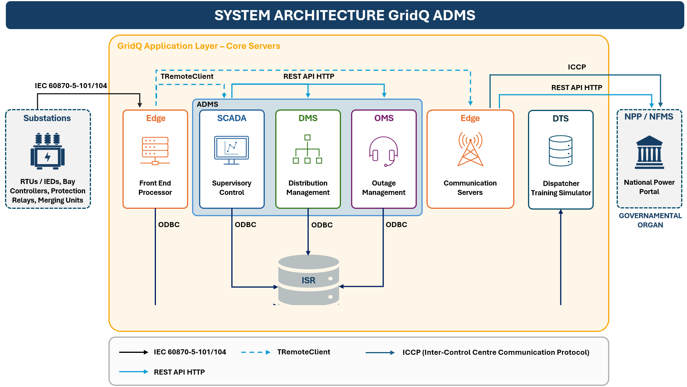

*Figura 11 — Arquitetura do Sistema — Sharika SpinTech ADMS*

### 1.2.1 SpinTech SCADA

The SCADA (Supervisory Control and Data Acquisition) module constitutes the operational foundation of the SpinTech ADMS solution, being responsible for real-time data acquisition, electrical network supervision, event processing, historical storage, and execution of remote commands on field equipment. The system was designed with a modular and redundant architecture, operating in a 64-bit environment, with high availability and support for multiple communication protocols used in power distribution systems.

The platform continuously acquires information from the SpinTech Edge using a proprietary protocol, collecting analog quantities, digital states, alarms, and sequence-of-events (SOE) records. Among the monitored data are active and reactive power, per-phase voltage and current, power factor, imported and exported energy, transformer oil and winding temperatures, TAP position, and other operational network variables.

The system incorporates advanced data processing and validation functions, including conversion to engineering units, operational limit monitoring, telemetry fault detection, consistency checks on received values, rate-of-change calculation, and information quality code management. These features ensure that operators have access to reliable data for operational decision-making.

In the scope of supervision and control, the SCADA enables the safe execution of remote commands. Supported operations include opening and closing of circuit breakers, reclosers, disconnectors, and capacitor banks, as well as TAP raise/lower commands and setpoint transmission to intelligent devices. The system features interlocking mechanisms, operational blocking, permission verification, and a complete audit trail for all actions performed by operators.

The human-machine interface (HMI) provides substation single-line diagrams, alarm and event panels, historical trends, operational dashboards, and configurable reports. The environment supports local, web, and mobile clients, allowing secure access to operational information from different levels of the organization.

Complementing real-time operational functions, the SCADA maintains a data and event historian that continuously stores analog measurements, digital states, alarms, and SOE records in a relational database. This information is used for operational analyses, incident investigation, report generation, and indicator calculation.

In this way, the SCADA module provides a complete, real-time view of the electrical system, enabling continuous monitoring, secure remote control, detailed historical recording, and integration with advanced distribution management applications, forming the operational foundation of the entire ADMS environment.

### 1.2.2 SpinTech DMS

The DMS (Distribution Management System) module of the SpinTech ADMS platform is responsible for analytical supervision, electrical modelling, operational optimization, and decision-making support in distribution networks. Integrated with the Edge (FEP), SCADA, OMS, and GIS modules, the DMS uses real-time information, historical data, and electrical network models to provide a complete operational view of the electrical system, enabling operators to keep the network operating safely, efficiently, and with high reliability levels.

The system maintains a detailed topological and electrical network model that covers substations, feeders, transformers, switching devices, consumers, and distributed energy resources. Through the Topological Processor, the DMS automatically identifies network connectivity and, in real time, recalculates the operational state after any change to switches, circuit breakers, or reclosers, serving as the basis for all analytical applications in the system.

<!-- Figura 12 (Distribution System Network Display) — imagem usada na pagina dedicada -->

Among its main functionalities are Load Flow studies, which allow calculation of voltages, currents, loadings, and power flows throughout the network, assisting in identifying overloads, technical losses, and operational limit violations. The module also offers State Estimation and Load Estimation capabilities, enabling reconstruction of the network's electrical behaviour even in areas without complete telemetry, using SCADA measurements, historical data, load curves, and intelligent algorithms to improve the accuracy of operational calculations.

The DMS also provides advanced applications for contingency analysis, short-circuit calculation, protection coordination, Volt/VAR control, capacitor bank control, voltage regulators, and On-Load Tap-Changing transformers (OLTC), enabling the reduction of technical losses, improvement of voltage profiles, and increased operational reliability of the system.

For operational planning, the system incorporates demand forecasting tools that use historical data and predictive models to anticipate future load behaviour and support decisions on dispatching, load transfer, and network expansion. Complementarily, the operational simulation mode enables operators to evaluate hypothetical scenarios, planned switching operations, and contingency conditions without affecting real operations, thereby reducing risks and increasing operational safety.

One of the most important features of the DMS is the FLISR (Fault Location, Isolation and Service Restoration) functionality, which automatically identifies the probable fault location, determines the switching operations required to isolate the faulty section, and proposes or executes supply restoration strategies through load transfer between feeders. This feature significantly reduces the number of affected consumers and the outage duration, directly improving continuity indicators such as SAIDI and SAIFI.

<!-- Figura 13 (Fault Locator Criteria) — imagem usada na pagina dedicada -->

<!-- Figura 14 (Fault Management & System Restoration Screen) — imagem usada na pagina dedicada -->

Beyond remotely controlled networks, the DMS also supports modelling and analysis of partially automated or non-remotely controlled networks, enabling load estimation in distribution transformers, probable fault location, circuit balancing, optimal network reconfiguration, and analysis of technical and non-technical losses.

In this way, the DMS module constitutes the analytical core of the ADMS platform, transforming operational data into actionable information for operation optimization, increased electrical system reliability, loss reduction, and continuous improvement of the quality of service provided to consumers.

### 1.2.3 SpinTech OMS

The OMS (Outage Management System) module of the SpinTech ADMS platform is responsible for the operational management of outages in the electrical distribution system, providing the Operations Centre with an integrated, real-time view of events that affect the continuity of power supply. The system serves as the primary tool for identifying, recording, analyzing, tracking, and restoring occurrences in the electrical network, integrating information from the Edge (FEP), SCADA, GIS, customer service, and field crews.

The OMS continuously monitors switching operations performed on the network, whether performed remotely via SCADA or manually recorded by operators for non-remotely controlled elements. Based on this information, the system automatically processes network topology, identifies energized and de-energized areas, determines affected customers, and records outage-related events.

One of the most important functionalities of the OMS is the intelligent management of events and incidents, enabling the automatic creation of predictive events from consumer calls or the actuation of SCADA-monitored devices. Using network electrical connectivity, the system identifies the probable fault location, assists operators in decision-making, and significantly reduces the time required to locate and restore power.

The system also incorporates Trouble Call System (TCS) functionalities, enabling the management of consumer calls, automatic correlation of received complaints, and identification of the common outage point. Integration with commercial systems allows service representatives to view detailed consumer information, including associated transformers, supply circuits, and service status, enabling faster, more accurate responses to network users.

<!-- Figura 15 (Event Management Window) — imagem usada na pagina dedicada -->

For maintenance crew management, the OMS provides resources for crew management, work orders, and AVL (Automatic Vehicle Location), enabling real-time tracking of field crew locations, task assignment, response time monitoring, and optimization of operational resource dispatch to incident locations.

The module automatically records the frequency and duration of outages, maintaining a complete history of events and affected consumers. Based on this information, it calculates regulatory and operational service quality indicators such as SAIDI and SAIFI, providing inputs for management analyses, regulatory reports, and electrical system reliability improvement programs.

<!-- Figura 16 (SAIDI and SAIFI Indicators Reports) — imagem usada na pagina dedicada -->

In addition to real-time operation, the OMS features an advanced simulation mode that enables pre-assessment of planned switching operations, maintenance shutdowns, and system restoration strategies. During simulation, the operator can analyse the expected impacts on consumers and continuity indicators, ensuring that planned interventions are carried out with the least possible impact on the power supply.

### 1.2.4 SpinTech DTS

The DTS (Dispatcher Training Simulator) is the advanced training module for SCADA/DMS/OMS system operators, designed to reproduce with a high degree of realism the behaviour of the electrical network and the operations centre. Its main objective is to train operators, dispatchers, and supervisors in a completely safe environment, without affecting the real operation of the electrical system.

The simulator fully replicates the functionalities of the SCADA/DMS/OMS operational environment, allowing users to perform the same actions, commands, analyses, and procedures used daily in the control centre. The system reproduces the behaviour of the distribution network in real time, including responses to simulated events, instructor actions, and operator decisions during training.

The DTS enables the creation and execution of various operational scenarios, including normal operating conditions, network disturbances, overvoltages and undervoltages, reactive power (VAR) control problems, cascading events, islanding of parts of the system, total blackouts, and complete system restoration procedures after contingencies. It also enables simulation of interactions with the SCADA, DMS, and OMS modules, providing an integrated training experience that adheres to operational reality.

The platform supports dedicated consoles for the Instructor and Trainee (Operator in Training), allowing the instructor to configure scenarios, introduce unexpected events, pause or accelerate the simulation, monitor actions executed, and evaluate participant performance. Scenarios can be built from the current system state, historical records, or previously defined event groups, enabling customized training for different operational situations.

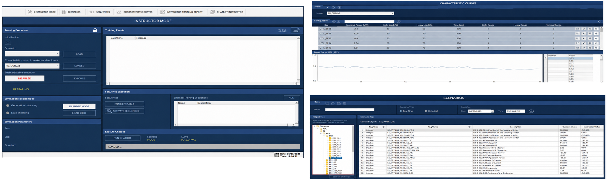

*Figura 17 — Telas do instrutor do DTS*

In addition to operational training, the DTS provides advanced performance evaluation resources, automatic report generation, tracking of operational indicators, and gamification mechanisms that stimulate continuous learning. The system records all actions performed during the session, enabling detailed analysis of participants' decision-making, response times, and operational efficiency.

In this way, the DTS constitutes a strategic tool for the development and certification of operators, reducing operational risks, improving contingency response capability, and increasing the reliability of electrical system operations through realistic training conducted in an environment completely isolated from the production network.

### 1.2.5 SpinTech Edge

SpinTech Edge is the module that connects the field operational environment to the SCADA/DMS/OMS ecosystem, serving as the intelligent layer for real-time data acquisition, processing, and integration. Installed at the edge of the operational network, the module concentrates communications from RTUs, FRTUs, IEDs, reclosers, disconnectors, fault indicators, and other automation devices, performing the collection, validation, processing, and secure forwarding of information to the control centre.

In addition to its data acquisition function, SpinTech Edge manages the execution of supervisory and control commands sent by the SCADA system, ensuring reliable and traceable communication between operators and field equipment. Its architecture supports redundancy and high availability, enabling continuous operation even in situations of communication failures or the unavailability of individual components.

The module offers native support for the main protocols used in the electrical sector, including IEC 60870-5-104, IEC 61850, DNP3, MODBUS, OPC UA, and ICCP/TASE.2, enabling seamless integration of equipment and systems from different manufacturers. Additionally, it provides interfaces for integration with corporate systems, GIS, commercial management platforms, billing, external operations centres, and regulatory applications through REST APIs, ODBC, and other standardized data exchange mechanisms.

SpinTech Edge also incorporates advanced cybersecurity features, including encrypted communication, device authentication, segregation between operational and corporate networks, access control, and event auditing. In this way, the module establishes a robust and secure infrastructure for the transport of operational information, ensuring low latency, high reliability and interoperability among all elements of the SpinTech ADMS platform.

## 1.3 Applicable Project Scope

| **Town** | **Group** | **Approx. 33/11 kV S/S** |
| --- | --- | --- |
| Dehradun | A (SCADA/DMS/OMS) | 32 |
| Haridwar | A (SCADA/DMS/OMS) | 16 |
| Rishikesh | A (SCADA/DMS/OMS) | 10 |

# System Architecture

## 2.1 Overall Architecture

The SCADA/DMS/OMS solution proposed for Dehradun, Haridwar, and Rishikesh is based on a centralized, modular architecture comprising three main layers: Field Level, Communication Layer, and Data Control Center (ADMS). The system operates from a single Control Centre responsible for the supervision, control, and integrated management of the electrical network, using redundant infrastructure to ensure high availability and operational continuity.

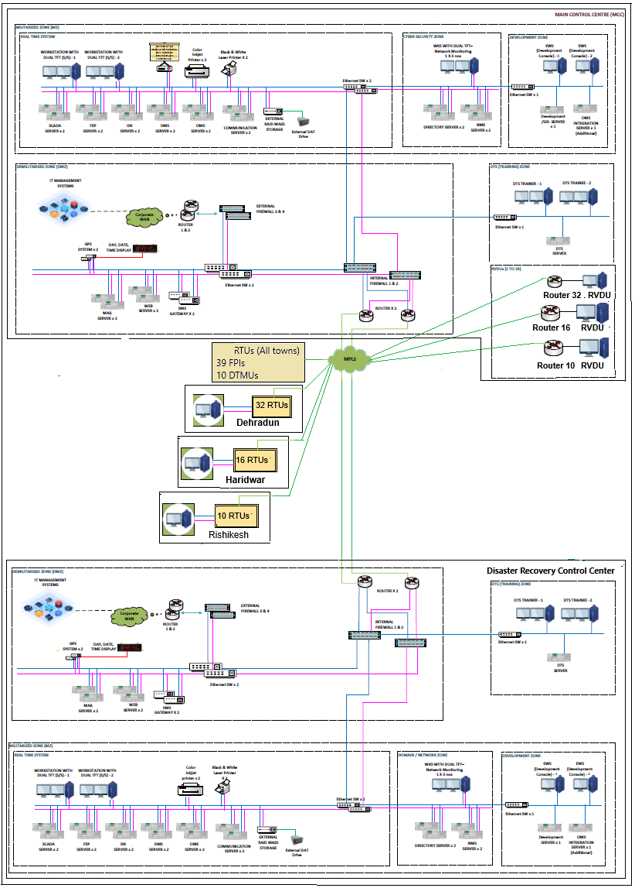

*Figura 21 — Arquitetura geral do sistema — Centro de Controle Principal (MCC)*

> Equipamentos de campo abrangidos: 993 FRTUs (todas as cidades) · 39 FPIs · 10 DTMUs.

### 2.1.1 Field Level

The field level comprises the devices responsible for acquiring operational network data and executing commands issued by the Control Centre.

Main components:

- RTUs (Remote Terminal Units) installed in the substations;

- FRTUs (Feeder Remote Terminal Units) installed in reclosers, RMUs, and sectionalisers;

- FPIs (Fault Passage Indicators) that are distributed across the distribution network.

These devices provide measurements, states, alarms, and operational information used by the SCADA, DMS, and OMS applications for real-time network monitoring and analysis.

### 2.1.2 Communication Layer

The communication layer is responsible for concentrating, processing, and transporting information between field devices and the Control Centre.

Main components:

- 2 Redundant FEP (Front-End Processor) Servers;

- Communication infrastructure for data acquisition from RTUs, FRTUs, and FPIs;

- Integration interfaces with external systems via OPC, ICCP, ODBC, and REST API.

The FEP servers handle communication with field equipment, manage telecommunications channels, and make data available to Control Centre applications. This layer also supports information exchange with corporate and legacy systems, as well as other external platforms.

### 2.1.3 Data Control Centre

The Control Centre consolidates all operational and analytical applications of the ADMS system and runs on a redundant, scalable architecture.

Main components:

- 2 SCADA Servers for real-time supervision and control;

- 2 ISR (Information Storage and Retrieval) Servers for historical storage, events, and reports;

- 2 DMS (Distribution Management System) Servers for advanced network analysis and operation functions;

- 2 OMS (Outage Management System) Servers for outage management and service restoration;

- 2 Communication Servers (integration with external agents);

- 2 NMS (Network Management System) Servers for infrastructure monitoring and cybersecurity;

- 2 Development Servers, containing the SCADA, DMS, OMS modules, and GIS integration;

- Disaster Recovery Centre (DRR), responsible for taking over operations when the main centre fails.

This infrastructure enables the integrated execution of SCADA, DMS, and OMS functions, including real-time data acquisition, operational supervision, historical storage, electrical network analysis, outage management, operator training, and disaster recovery.

## 2.2 Redundancy and Disaster Recovery

The SCADA/DMS/OMS architecture was designed to ensure high operational availability and continuity of critical services, minimizing the impacts from hardware, software, or communication infrastructure failures. To achieve this, the system adopts a combined strategy of operational redundancy and disaster recovery.

### 2.2.1 Redundancy Mechanism

All functions considered critical are supported by redundant infrastructure, eliminating single points of failure and ensuring the continuous availability of operational applications. The architecture includes redundant servers for the SCADA, FEP, ISR, DMS, OMS, Communication, and NMS modules, ensuring that isolated failures do not compromise system operation.

The redundancy mechanism uses a Hot-Standby architecture, in which a primary server and a standby server remain continuously synchronized. In the event of the main server's unavailability, client processes are automatically redirected to the backup server without any manual operator intervention.

In this way, operator workstations, engineering workstations, web clients, and other access interfaces continue to operate normally during the transition, significantly reducing the risk of interruption to Control Centre activities. This mechanism ensures that supervision, control, historical storage, distribution management, and outage management functions remain available even during failure events.

In addition to the operational environments, the solution provides dedicated development and training environments (DTS), isolated from real-time operations, enabling testing, updates, and operator training without impacting the production system.

### 2.2.2 Disaster Recovery Centre (DRR)

As an additional layer of protection, the architecture includes a Disaster Replica Recovery Centre (DRR), designed as a functional replica of the main Control Centre. The DRR maintains periodic synchronization of databases, configurations, and operational information, remaining ready to fully take over operations in situations of unavailability of the main environment.

When a critical failure occurs in the main Control Centre, field devices — including RTUs, FRTUs, and FPIs — automatically switch to reporting to the DRR, which assumes the role of master operations centre. The switchover process is carried out by synchronization and interlocking mechanisms that prevent simultaneous operations between the two control centres, preserving information integrity and operational security.

According to the solution requirements, the transition between the main Control Centre (located in Haldwani) and the DRR must occur within 15 minutes, ensuring continuity of supervision and control activities even in the event of severe unavailability. After recovery of the main environment, operational data is re-synchronized, and the architecture can return to normal operating configuration.

The combination of Hot-Standby redundancy for critical servers and a dedicated Disaster Recovery Centre provides high operational resilience, ensuring continuous availability of SCADA, DMS, and OMS functions and significantly reducing risks associated with the main infrastructure failure.

---

<!-- ============================================================ -->
<!-- PÁGINA 2 — Volume II — rota: /scada -->
<!-- ============================================================ -->

# PÁGINA 2 · Volume II

**Rota:** `/scada` · **Selo:** `Volume II` · **Título:** SCADA — Supervisory Control and Data Acquisition
**Subtítulo:** Camada de supervisão, operação e visualização

# SCADA Functions – Functional Design

## 4.1 SCADA Module Overview

The SpinTech SCADA module constitutes the supervision, operation, and visualization layer of the ADMS system. Its primary function is to provide operators with a complete and up-to-date representation of the electrical system through graphical interfaces, operational control capabilities, alarm management, historical data storage, and real-time analysis tools.

In the proposed architecture, all functions related to field-device communication, telecontrol protocols, and data acquisition are handled by the SpinTech Edge module. The SCADA module receives this information via an integration infrastructure based on the TRemoteClient protocol, transparently inheriting the structure of points, states, events, alarms, measurements, and operational attributes required for grid supervision and operation.

The platform provides a unified Human-Machine Interface (HMI) for operators, engineers, supervisors, and other authorized users, supporting local, remote, and web-browser access. Navigation is based on single-line diagrams, substation displays, operational dashboards, alarm and event lists, trends, and reports, ensuring a consistent operational experience across the entire ADMS environment.

The SCADA functional architecture comprises the following main modules:

- Displays (HMI);

- Alarms and Events;

- Supervisory Control;

- Historian and Trends;

- Reports;

- Scripts and Automation;

- Security and User Management.

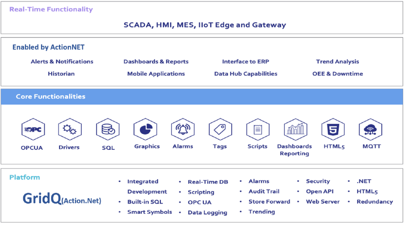

*Figura 41 — Camadas do SpinTech SCADA*

## 4.2 SCADA Data Sources and Types

*(MTS Chapter 2 – §2.2.2)*

Although information acquisition is performed by SpinTech Edge, the SCADA module maintains a complete operational representation of the electrical network through the TRemoteClient integration.

The main types of data made available to the SCADA include:

- Analog measurements from substations, feeders, and distribution automation devices;

- Digital states of switching and protection equipment;

- Information from reclosers, RMUs, remote-controlled switches, and other automated assets;

- Fault passage indications (FPI);

- SOE events with timestamp;

- Calculated data and operational indicators;

- Information entered manually by operators;

- Corporate electrical model data in CIM standard (IEC 61968/61970).

When available, the electrical model can be automatically loaded from corporate GIS systems through CIM/XML adapters, reducing manual modelling activities and ensuring consistency between the corporate and operational environments.

## 4.3 Supervisory Control

*(MTS §2.2.9)*

SpinTech SCADA provides supervisory control features for the remote operation of electrical network assets. The command process follows the Select-Check-Before-Operate (SCBO) philosophy, ensuring that all operational and security verifications are completed before the command is executed.

Command transmission to field devices is performed by SpinTech Edge, with the SCADA responsible for operational validation, process coordination, and operator interaction.

The main types of control supported include:

- Opening and closing of circuit breakers, reclosers, and switches;

- Capacitor bank control;

- Fault indicator reset;

- Voltage regulator and OLTC control;

- Setpoint control;

- Group control;

- Automatic execution of switching sequences.

The system incorporates operational interlocking mechanisms, blocking tags, permission validation, and a comprehensive audit of user-performed operations.

Before executing any command, conditions such as telemetry availability, equipment operating mode, active blocks, maintenance status, configured interlocks, and operator permissions are automatically verified.

## 4.4 SCADA Programming Language and Automation

*(MTS §2.2.8)*

The SpinTech SCADA automation environment enables the development of operational logics, calculations, integrations, and utility-specific functionalities.

The following technologies are supported:

- C# and VB.NET for automations, calculations, and operational logic;

- Python for advanced analyses, artificial intelligence, and external integrations;

- JavaScript for dashboards and HTML5 interfaces;

- Automation framework with functionalities equivalent to IEC 61131-3.

The C# and VB.NET scripts are compiled, providing high execution performance. The environment offers advanced engineering features, including automatic cross-references, object updates, integrated debugging, step-by-step execution, variable monitoring and exception tracking.

These features enable operational automation, real-time calculations, and other functionalities required for the supervisory system's operation.

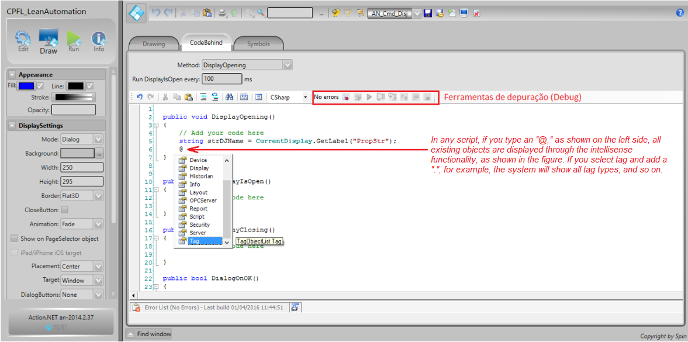

*Figura 42 — Ambiente para escrever, compilar e depurar scripts*

## 4.5 Historical Storage and Operational Playback

*(MTS §2.2.6)*

The Historian sub-module is responsible for the continuous storage of operational information received by the SCADA. The following are stored:

- Analog measurements;

- Digital states;

- Alarms;

- Events;

- Energy data;

- Calculated variables;

- Operational records and audits.

The data is maintained in PostgreSQL relational databases residing on the ISR (Information, Storage, and Retrieval) server. The minimum online retention period is 2 years, meeting the utility's operational, regulatory, and historical analysis requirements.

In addition to historical storage, the system provides Operational Playback functionalities, enabling reconstruction of the electrical network state at any point in the past directly on single-line diagrams and operational screens.

The module also offers advanced graphical and tabular trend features, enabling temporal analysis, variable comparison, time zoom, and investigation of operational occurrences.

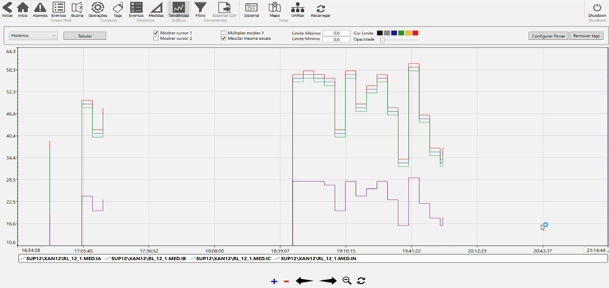

*Figura 43 — Tendências em tempo real e históricas disponíveis no SCADA*

## 4.6 Sequence of Events (SOE)

*(MTS §2.2.2)*

The SOE module enables the chronological consolidation of events from SpinTech Edge-supervised equipment.

Events are received by the SCADA through the TRemoteClient infrastructure, preserving their original timestamps and enabling the precise reconstruction of occurrences recorded in the electrical network.

Each SOE record can store:

- Date and time of the occurrence;

- Associated equipment;

- Event type;

- Previous and subsequent state;

- Information quality;

- Event source;

- Related installation or feeder.

Events are stored in the alarm and event historical database and remain available for online queries and historical analyses. The event interface allows filtering by period, installation, equipment, feeder, category, or occurrence type, supporting operations, post-fault analysis, disturbance investigation, and operational auditing. This functionality is one of the main operational analysis tools in the SCADA system, providing complete traceability of electrical system events and enabling a detailed understanding of network behaviour under normal conditions, contingencies, and emergencies.

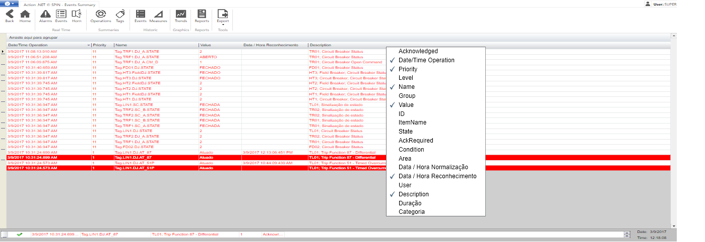

*Figura 44 — Resumo de eventos com dezenas de colunas disponíveis no SCADA*

---

<!-- ============================================================ -->
<!-- PÁGINA 3 — Volume II — rota: /adms -->
<!-- ============================================================ -->

# PÁGINA 3 · Volume II

**Rota:** `/adms` · **Selo:** `Volume II` · **Título:** ADMS / DMS — Distribution Management System
**Subtítulo:** Núcleo analítico e operacional da rede de distribuição

# Distribution Management System (DMS) – Functional Design

## 6.1 Overview

The SpinTech DMS (Distribution Management System) module is the analytical and operational core responsible for advanced supervision, real-time analysis, operational optimization, and decision-making support for electrical distribution networks.

| **SCADA vs. DMS** |
| --- |
| **SCADA** | Acquires data and executes supervisory commands. |
| **DMS** | Uses the complete electrical model for advanced analyses, identifies abnormal conditions, and proposes corrective or optimization actions. |

All SpinTech DMS applications share a common electrical model — including substations, feeders, transformers, switches, reclosers, voltage regulators, and capacitor banks — ensuring consistency between analyses, simulations, and real-time operations. The functionalities in this section meet the requirements of MTS §3.1.

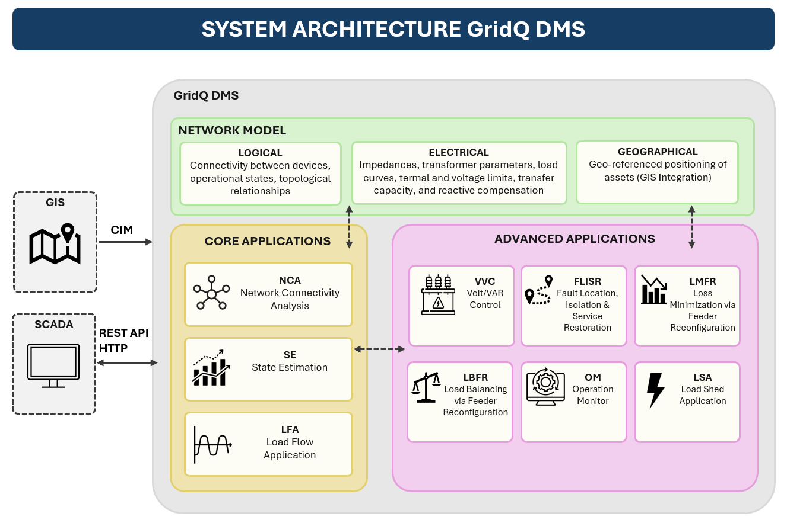

*Figura 61 — Arquitetura do Sistema — SpinTech DMS*

## 6.2 Network Model

Network modelling is the foundation of all SpinTech DMS functionalities. A single shared electrical model ensures consistency between connectivity analysis, power flow, state estimation, FLISR/FMSR, Volt/VAR control, load balancing, and outage management (MTS §3.1).

### 6.2.1 Model Representations

| **Dimension** | **What is modelled** |
| --- | --- |
| Logical | Connectivity between devices, operational states, and topological relationships |
| Electrical | Impedances, transformer parameters, load curves, thermal and voltage limits, transfer capacity, and reactive compensation |
| Geographical | Geo-referenced positioning of assets (optional GIS integration) |

### 6.2.2 Represented Assets

| **Devices included in the model** Substations, busbars, and power transformers; Primary feeders and laterals; Voltage regulators and capacitor banks; Reclosers, disconnectors, and fuses; Fault indicators (FPI) and remote units; Switching and protection devices in general. |
| --- |

### 6.2.3 Synchronization and Update

The model maintains permanent synchronization with the SCADA. Remotely controlled equipment is updated automatically. For non-remotely controlled devices, switching operations performed in the field are recorded by the operator, and the Topological Processor is automatically triggered after each confirmation.

### 6.2.4 GIS Integration and CIM Standard

| **System / Protocol** | **Description** |
| --- | --- |
| **GIS** | Bidirectional synchronization: incremental asset updates without manual remodelling, ensuring consistency between engineering, planning, and operations. |
| **IEC CIM (61968/61970)** | SpinTech DMS can consume data from GIS systems or corporate repositories via CIM/XML adapters, preserving a single data source and reducing inconsistencies. |

## 6.3 DMS Application Functions — Overview

SpinTech DMS comprises an integrated set of analytical applications that operate on the same electrical model. The table below summarises each function and its main objective.

| **Acronym** | **Name** | **Main Objective** |
| --- | --- | --- |
| NCA | Network Connectivity Analysis | Continuously determine the electrical network topology. |
| SE | State Estimation | Estimate quantities at points without direct measurement. |
| LFA | Load Flow Application | Calculate the complete electrical behaviour of the network. |
| VVC | Volt/VAR Control | Optimize voltage and reactive power flow. |
| FLISR | Fault Location, Isolation & Service Restoration | Detect, isolate, and restore the network after faults. |
| LMFR | Loss Minimization via Feeder Reconfiguration | Reduce technical losses through feeder reconfiguration. |
| LBFR | Load Balancing via Feeder Reconfiguration | Redistribute the load to balance the loading. |
| OM | Operation Monitor | Monitor operational wear and asset reliability. |
| LSA | Load Shed Application | Automate load shedding and restoration in contingencies. |

### 6.3.1 Network Connectivity Analysis (NCA)

The NCA is the operational foundation of SpinTech DMS. It continuously determines the electrical network topology and feeds all other analytical applications. It is executed automatically at every state change received from the SCADA or recorded by the operator.

#### 6.3.1.1 What the NCA determines

| **Topology** | **Abnormal Conditions** |
| --- | --- |
| Busbar and feeder connectivity Energized and de-energized areas Available power sources Radial and meshed configurations Alternative paths for load transfer | Electrical islanding Unauthorized parallels Loop formation Inconsistent switch states Equipment isolated from the main topology |

#### 6.3.1.2 Network Tracing Functions

| **Function** | **Description** |
| --- | --- |
| Feeder Trace | Complete feeder tracing. |
| Circuit Trace | Electrical circuit tracing. |
| Between Trace | Tracing between two selected points. |
| Downstream Trace | Downstream tracing from a source point. |
| Consumer Trace | Identification of connected consumers, loads, and devices. |
| Impact Trace | Identification of areas affected by switching operations or contingencies. |

#### 6.3.1.3 Temporary Network Representation

For operational and maintenance activities, the NCA allows modelling of temporary changes without modifying the real-time configuration: temporary cuts, phase, temporary jumpers, temporary groundings, and provisional maintenance configurations. Alarms are automatically generated for detected abnormal conditions, serving as a trigger for advanced applications such as LFA, VVC, FLISR, and LSA.

### 6.3.2 State Estimation (SE)

State Estimation provides a complete and continuously updated electrical representation of the network, even in regions without direct SCADA measurements. It is executed automatically after topological changes or significant updates to field measurements.

#### 6.3.2.1 Algorithm Inputs

| **Data sources used by the SE** Real-time SCADA measurements; Topology calculated by the NCA; Daily historical profiles and typical consumption curves; Equipment electrical parameters. |
| --- |

#### 6.3.2.2 Estimation Process — Steps

| **Step** | **Description** |
| --- | --- |
| 1. Load pre-estimation | Assigns initial active and reactive power values to each segment based on historical profiles and available measurements. |
| 2. Measurement validation | Identifies and eliminates/corrects inconsistent values, defective measurements, and inconsistent data (Bad Data Identification). |
| 3. Calibration and allocation | Distributes estimated loads across medium voltage busbars and segments according to electrical and topological criteria. |

#### 6.3.2.3 Quantities Estimated for All Elements

| **Voltage / Current** | **Power / PF** | **Losses / Loading** |
| --- | --- | --- |
| Voltage magnitudes at busbars/nodes Circuit currents | Active and reactive power Power factor | Technical losses (active and reactive) Transformer, feeder, and lateral loading |

The results directly feed LFA, VVC, FMSR/FLISR, LMFR, and LBFR. The application operates in both real-time and study mode.

### 6.3.3 Load Flow Application (LFA)

The Load Flow Application is the analytical core of SpinTech DMS. It transforms topology (NCA) and estimated state (SE) information into operational knowledge by computing the network's complete electrical behaviour at each instant, thereby forming the technical basis for all other advanced applications.

| **Calculation Engine** SpinTech DMS uses OpenDSS (EPRI) as the LFA engine, operating on the complete electrical model, current topology, equipment states, and SE/SCADA results. |
| --- |

#### 6.3.3.1 When the LFA is executed

| **Automatic trigger events** Topology changes identified by the NCA; Opening or closing of switches, reclosers, and circuit breakers; TAP changes in transformers and voltage regulators; Significant load variations or overloads; Changes in the state of reactive compensation equipment; Operator request or triggering by other DMS applications. |
| --- |

#### 6.3.3.2 Quantities Calculated by the LFA

| **Per Equipment** | **Per Region / Area** |
| --- | --- |
| Voltage and phase angle at busbars Currents in all branches Active/reactive power and power factor Feeder and transformer loading | Technical losses per feeder and substation Three-phase and per-phase losses Voltage drops along circuits Operational limit violations |

#### 6.3.3.3 Central Role in the DMS Architecture

| **Module** | **Function** |
| --- | --- |
| **NCA** | Informs how the network is connected. |
| **SE** | Estimates the most likely electrical condition of the network. |
| **LFA ★** | Determines how energy flows, which equipment is overloaded, which loads can be transferred, and which actions produce the best operational results. |

Before any switching operation, the operator can use the LFA in study mode to simulate scenarios and pre-assess impacts — fundamental for FLISR, LMFR, LBFR, VVC, and LSA.

### 6.3.4 Volt/VAR Control (VVC)

The VVC coordinates the optimization of voltage levels and reactive power flow in the distribution network, maintaining the voltage profile within operational limits, reducing technical losses, and improving supply quality.

| **Coordinated Equipment** | **Optimisation Objectives** |
| --- | --- |
| On-Load Tap Changers (OLTC) Voltage regulators Fixed capacitor banks Switched capacitor banks | Minimization of technical losses Improvement of the voltage profile Reactive flow control Load balancing |

SpinTech DMS continuously evaluates the topological configuration, operational limits, circuit loading, and operator-defined constraints to generate switching plans. The system operates in manual or operator-assisted automatic mode.

### 6.3.5 FLISR – Fault Location, Isolation and Service Restoration

The FLISR (Fault Location, Isolation and Service Restoration) supports the detection, location, isolation, and restoration of the network after faults, in accordance with the FMSR defined in MTS §3.1.5. It operates in an integrated manner with the NCA, SE, LFA, SCADA, and the electrical model.

#### 6.3.5.1 FLISR Process Flow

| **Etapa** | **Description** |
| --- | --- |
| 1. Detection | Monitors circuit breaker, recloser, and FPI operation and abrupt changes in electrical quantities. Applies a configurable wait period to prevent unnecessary restorations caused by transient events. Supervisory switching operations do not initiate the process. |
| 2. Location | Uses circuit breaker/recloser states, communicable FPIs, current/voltage telemetry, and NCA topology to identify the faulty section. The identified area is visually highlighted on operational diagrams and maps. |
| 3. Isolation | Generates the switching sequence to electrically isolate the faulty section, respecting operational limits and equipment capacity. |
| 4. Restoration | Evaluates alternative supply paths and executes LFA-validated load transfers to restore the maximum number of consumers possible. |
| 5. Pre-fault return | After fault elimination, it automatically generates an optimized switching sequence to restore the original configuration. |

#### 6.3.5.2 Storm Mode

Allows suspension of automatic restoration actions during exceptional situations (storms, large-scale events). Detection, analysis, and isolation functions remain active, but restoration remains under direct operator control.

#### 6.3.5.3 Operating Modes

| **Operating Mode** | **Description** |
| --- | --- |
| **Automatic** | Calculates and executes isolation and restoration plans after validation by the responsible operator. |
| **Manual** | Generates recommendations and presents the complete switching sequence for step-by-step execution by the operator. |

#### 6.3.5.4 Reports Generated by FLISR

| **Information available after each occurrence** Complete fault analysis and sequence of switching operations executed; Total outage time per feeder; date and time of each event; Amount of load interrupted and restored; Number of consumers affected and restored; Operational limit violations identified by the LFA; Alternative restoration plans ranked by operational merit; Complete traceability: user, date, time, and context of each operation. |
| --- |

### 6.3.6 Loss Minimization via Feeder Reconfiguration (LMFR)

The LMFR automatically identifies opportunities to reduce technical losses through operational network reconfiguration, exploiting already available resources without requiring infrastructure investments.

#### 6.3.6.1 How It Works

| **Phase** | **Action** |
| --- | --- |
| Initial assessment | Calculates existing losses in the current configuration (feeders, transformers, and other elements) |
| Scenario simulation | Simulates combinations of opening/closing of normally open switches and transfers between adjacent feeders |
| LFA validation | Runs power flow for each alternative; only configurations that meet all operational criteria are recommended |

#### 6.3.6.2 Criteria Verified for Each Alternative

| **Electrical Criteria** | **Operational Constraints** |
| --- | --- |
| Technical losses and voltage profile Feeder and transformer loading Thermal limits and circuit capacity Active and reactive power flows | Planned and unplanned outages Equipment out of service or blocked Blocking tags (Control Inhibit Tags) Operations centre constraints |

#### 6.3.6.3 Operating Modes and Frequency

| **Feature** | **Description** |
| --- | --- |
| **Frequency** | Automatic periodic execution (typically every 15 minutes) and on operator demand or triggered by other DMS applications. |
| **Automatic** | Generates switching plans automatically; after operator validation, executes via SpinTech SCADA. |
| **Manual** | Presents all alternatives with operational benefits for operator-assisted decision and execution. |

What-If features allow simulation of strategies before execution. Reports include losses before/after reconfiguration, percentage reduction, power flows, and a complete list of recommended operations.

### 6.3.7 Load Balancing via Feeder Reconfiguration (LBFR)

The LBFR optimizes network loading by dynamically redistributing load between feeders and adjacent operational areas, eliminating imbalances, maximizing asset utilization, and increasing available operational capacity.

#### 6.3.7.1 When the LBFR is Triggered

| **Events that initiate balancing** Overload of feeders or distribution/power transformers; Significant imbalance between neighboring feeders; Unequal loading between circuits of the same substation; Significant load changes throughout the day or topological changes; Explicit operator request or scheduled execution. |
| --- |

#### 6.3.7.2 Criteria Evaluated for Each Transfer Scenario

| **Parameter** | **Assessment** |
| --- | --- |
| Loading | Feeders and transformers involved (before and after). |
| Voltage | Resulting voltage profile across the entire affected area. |
| Losses | Impact on technical losses associated with the new flow. |
| Capacity | The remaining operational margin of the receiving circuits. |
| Transient overloads | Duration, magnitude, and acceptability of intermediate conditions during the transfer. |

#### 6.3.7.3 Operating Modes

| **Mode** | **Description** |
| --- | --- |
| **Automatic** | Generates and executes switching plans after operator validation, via SpinTech SCADA. |
| **Manual** | Presents alternatives ranked by merit; assisted and sequential execution. |

What-If features and LFA simulation are available before any execution. Reports include loading condition before/after, participating feeders, redistributed load, percentage asset utilization, and resulting voltage profile.

### 6.3.8 Operation Monitor

The Operation Monitor tracks the operational condition of assets, transforming operational events and histories into indicators for maintenance management and increased network reliability.

#### 6.3.8.1 Monitored Equipment

| **Continuously supervised devices** Circuit Breakers (CBs) and automatic reclosers; Disconnectors and load break switches (LBS); Switched capacitor banks; On-Load Tap Changers (OLTCs); Motorized switches and supervised protection equipment. |
| --- |

#### 6.3.8.2 Information Maintained per Equipment

| **Indicator** | **Description** |
| --- | --- |
| Total accumulated operations | Counter updated at every device operation. |
| Fault operations | Specific counter for operations resulting from faults. |
| Date/time of last operation | Temporal record of the last switching operation executed. |
| Complete history | Log of all operations with operational context. |
| Current state | Current operational condition of the equipment. |

#### 6.3.8.3 Alarms and Configurable Limits

Operational limits are configured individually per equipment (manufacturer criteria, utility policy or specific requirements). Alarms are automatically generated when monitored values exceed defined limits.

| **Conditions that generate alarms** Maximum number of total or fault operations reached; Excessive operating frequency in a given period; Identified operational wear conditions. |
| --- |

#### 6.3.8.4 Calculated Reliability Indicators

| **Indicador** | **Description** |
| --- | --- |
| Failure Frequency | Number of failures occurring in a given period. |
| Failure Rate | Probability of failure occurrence based on operational history. |
| MTBF | Mean Time Between Failures — average time between successive failures. |
| MTTR | Mean Time to Repair — average time for repair or restoration after failure. |
| Downtime | Accumulated unavailability time of equipment. |
| Availability | Operational availability, considering recorded operations and unavailability. |
| Pareto Analysis | Identifies equipment/feeders that concentrate the largest share of occurrences and failures. |

#### 6.3.8.5 Condition-Based Maintenance (CBM)

Operation Monitor data enables Condition-Based Maintenance strategies: instead of fixed-period maintenance, the utility uses actual utilization and wear data to determine the optimal timing of interventions.

| **CBM Benefits** Reduction of unexpected failures and increased asset service life; Better utilization of maintenance teams; Optimization of operational costs; Risk-based investment prioritization; Improvement of supply continuity indicators. |
| --- |

Authorized users can reset counters after maintenance, temporarily disable counting, and adjust monitoring and alarm-generation criteria.

### 6.3.9 Load Shed Application (LSA)

The LSA automates the load shedding and restoration process in contingency situations, operational constraints, or frequency control, determining the optimal combination of switching devices to achieve the target quantity with minimal impact on consumers (MTS Chapter 2, §2.4).

#### 6.3.9.1 Prioritization Rules

| **Criterion** | **Logic** |
| --- | --- |
| Load Priority (1–10) | Hospitals, critical infrastructure, strategic consumers, and high-revenue/low-loss feeders receive higher priority and are preserved. |
| Shedding History (24 h) | The algorithm distributes impacts equitably, avoiding repetitive shedding in the same regions. |
| Affected Consumers | Among equivalent alternatives, select the configuration that affects the fewest consumers. |

#### 6.3.9.2 Four Operating Modes

| **Modo** | **Operation** |
| --- | --- |
| Manual Load Shed | The operator specifies the load to be shed; the system calculates all combinations and presents alternatives (load removed, consumers affected, priority, and equipment involved); the operator selects and executes. |
| Manual Load Restoration | Identical to manual shedding but focused on restoration; maintains timers and generates alarms when scheduled restoration is due. |
| Automatic Load Shed | Executes automatic shedding based on system frequency (parameters LSS_str / LSS_stp) or scheduled time (Time-of-Day). |
| Automatic Load Restoration | Automatically restores load when operating conditions return to normal (parameters LSR_str / LSR_stp), by frequency or scheduled times. |

#### 6.3.9.3 Records, Alarms, and Reports

All shedding and restoration operations are recorded as permanent operational events. Failures in executing supervisory commands generate specific alarms with probable cause.

| **Available in the LSA history** Daily and operational area reports; Complete event history; Statistics of load shed and restored; Complete operational audit. |
| --- |

## Telas do sistema

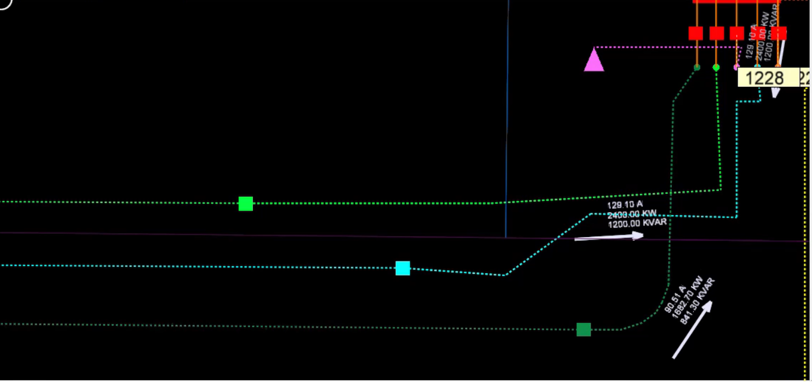

*Display da rede do sistema de distribuição (Figura 12)*

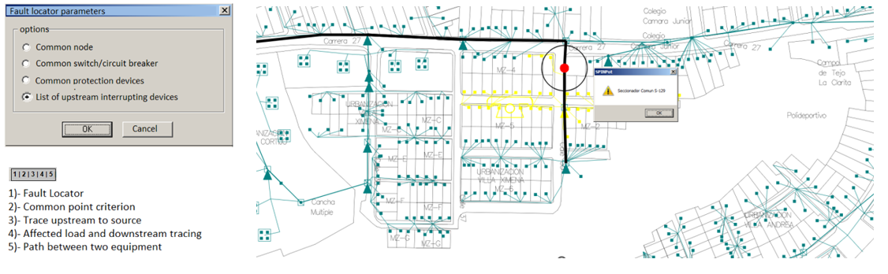

*Critérios do localizador de faltas (Figura 13)*

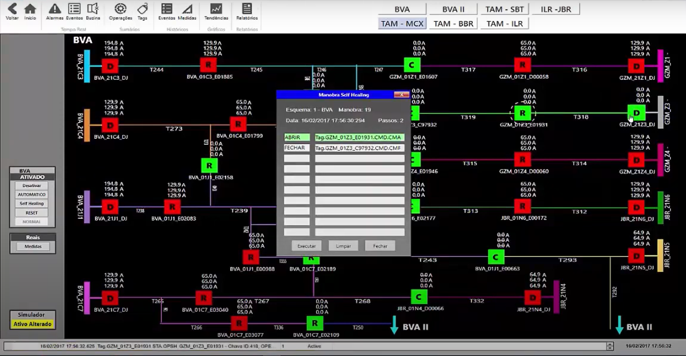

*Tela de gestão de faltas e restauração do sistema (Figura 14)*

---

<!-- ============================================================ -->
<!-- PÁGINA 4 — Volume II — rota: /oms -->
<!-- ============================================================ -->

# PÁGINA 4 · Volume II

**Rota:** `/oms` · **Selo:** `Volume II` · **Título:** OMS — Outage Management System
**Subtítulo:** Gestão de interrupções, chamadas e indicadores de continuidade

# Outage Management System (OMS) – Functional Design

## 7.1 Overview

SpinTech OMS (Outage Management System) is the specialized outage management module of the SpinTech ADMS platform. Natively integrated with the SCADA, the network electrical model, and the advanced DMS functions, it provides the Operations Centre with a unified view of outages, field crews, affected consumers, and regulatory continuity indicators.

| **Implemented functionalities (MTS §3.2)** Outage Scheduling Management — planned outage management; Trouble Call Management System (TCS) — consumer call management; Crew Dispatch & Work Management — crew dispatching and work orders; Outage Analytics & Reporting — dashboards and analytical reports; Web Clients & Mobile Views — access via browser and mobile devices. |
| --- |

The OMS operates on a georeferenced electrical network model, correlating SCADA events, protection devices, consumer calls, operational records, and field activities to automatically determine the extent of the outage, the affected consumers, and the best restoration strategies.

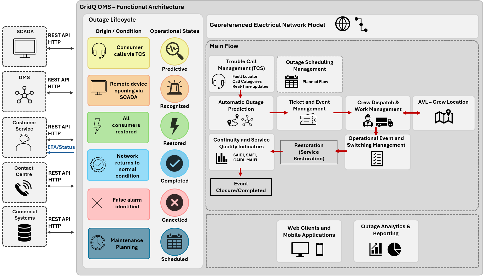

*Figura 71 — Arquitetura Funcional — SpinTech OMS*

## 7.2 Outage Lifecycle

Each event recorded in the OMS goes through well-defined operational states, enabling real-time tracking from detection to closure.

| **State** | **Origin / Condition** | **Description** |
| --- | --- | --- |
| Predictive | Consumer calls via TCS | Outage inferred from received calls; the probable fault area is propagated downstream of the protection device that operated. |
| Recognized | Remote device opening via SCADA | Automatically generated by the opening of a remotely controlled circuit breaker/recloser reported by the SCADA or confirmed by the DMS. |
| Restored | All consumers restored | The ticket is automatically closed by the OMS, which initiates the consumer callback process. |
| Completed | Network returns to normal condition | Complete resolution of the outage, with no remaining contingencies. |
| Cancelled | False alarm identified | The ticket was manually canceled by the operator after verification. |
| Scheduled | Maintenance planning | Planned shutdown with prior notification to affected consumers. |

### 7.2.1 History Associated with Each Event

| **Operational Data** | **Impact Data** |
| --- | --- |
| Time of occurrence Equipment involved Assigned crews Cause of outage | Affected consumers Energy not supplied Restoration time Materials and operational costs |

## 7.3 Outage Scheduling Management

The Planned Outage Management module enables planning and control of shutdowns required for maintenance, expansion or modernisation of the electrical network.

| **Module Functionalities** | **The Electrical Model Determines** |
| --- | --- |
| Registration of shutdown requests Request prioritization Issuance of work permits Operational planning Real-time status update Closure of work orders Prior notification to affected consumers | Impacted consumers Affected transformers Interrupted loads Devices involved Projected continuity indicators |

The system also allows field crews to report delays, schedule changes, and updated power restoration forecasts, keeping operators and consumers continuously informed.

7.4. Trouble Call Management System (TCS)

The TCS manages consumer calls related to outages, acting as a correlation mechanism between field information, operational events, and registered complaints (MTS §3.2.2). Integrated with the geo-referenced electrical model, the SCADA, and corporate customer service systems.

### 7.4.1 Automatic Fault Location (Fault Locator)

Upon receiving a call, the system automatically identifies the customer unit, its geographic location, and its connection to the electrical grid. The incident is then linked to an existing event or used to create a new predictive outage - enabling the identification of faults not yet detected by remote-controlled devices.

### 7.4.2 Continuous Prediction Refinement

As new calls are registered, the system analyses the geographical distribution of affected consumers, the network topology, existing protection devices, and SCADA events, dynamically adjusting the probable fault area and the most likely outage point.

### 7.4.3 Call Categories

| **Category** | **Description** |
| --- | --- |
| Normal | Standard calls from residential and commercial consumers. |
| Critical | Occurrences with significant operational impact or safety risk. |
| Premium / VIP | Differentiated treatment for the utility's strategic consumers. |
| Medical | Consumers with special health needs who depend on electrical power. |

### 7.4.4 Call Lifecycle — States

| **Opening** | **In Progress** | **Resolution** | **Closure** |
| --- | --- | --- | --- |
| Unassigned Assigned Incident | Trouble Call Outage | Completed Rejected | Closed |

### 7.4.5 Integration and Service Channels

| **Channels and systems integrated with the TCS** Utility Customer Service Centre (via Communication Server / SpinTech Edge); Contact Centre and IVR (Interactive Voice Response); Mobile applications and digital service channels; OPC interfaces, Web Services, and REST APIs for real-time updates. |
| --- |

This architecture enables automated call reception, automatic fault logging, incident status updates, and the communication of estimated restoration times, reducing the need for manual intervention.

## 7.5 Automatic Outage Prediction

When a supervised protection device operates due to a fault, the OMS automatically performs a downstream electrical analysis of the operated equipment (outage prediction), electrically traversing the downstream network to create outage tickets and reduce the time to identify the occurrence.

| **The System Determines** | **Automatic Closure** |
| --- | --- |
| Impacted feeders Affected transformers Consumers without power Probable fault area | When the device returns to the normal state (automatically or by SCADA command), the ticket is closed and the communication and event closure procedures are initiated. |

## 7.6 Ticket and Event Management

All outage records are organized in a structured ticket system, with categorization, operational states, and flexible display options.

### 7.6.1 Available Display Filters

| **Operators can filter tickets by** Electrical area, geographical region, or feeder; Responsible substation; Assigned crew; Call criticality. |
| --- |

All information is available in both tabular and interactive map formats, enabling simultaneous analysis of multiple occurrences.

## 7.7 Crew Dispatch & Work Management

The Crew Dispatch and Work Order Management module provides tools for complete management of field resources involved in system restoration.

| **Real-Time Monitoring** | **Management Functionalities** |
| --- | --- |
| Crew locations Each crew's workload Open work orders Activities in progress Restoration progress | Work order creation Automatic or manual crew assignment Execution monitoring Linking between orders and OMS events Operational closure of activities |

The operational interface features visual progress indicators that facilitate dispatchers' decision-making in contingency situations.

## 7.8 AVL – Crew Location

The OMS incorporates AVL (Automatic Vehicle Location) functionality to monitor field crews' locations on the operational map.

| **Information** | **Description** |
| --- | --- |
| Current location | Real-time geographical position of each field crew. |
| Distance to occurrence | Calculated the distance between the crew and the fault point. |
| Crew status | Available or busy with another activity. |
| Travel time | Estimated time of arrival at the occurrence location. |
| Automatic crew suggestion | Together with the DMS and FLISR, the system can automatically suggest the crews closest to the fault. |

## 7.9 Operational Event and Switching Management

The OMS fully records all switching operations associated with isolation and restoration processes, maintaining a detailed history of each event.

| **Automatically Recorded** | **Supplemented After Restoration** |
| --- | --- |
| Equipment operated Time of each switching operation Crews involved Resources employed Operational costs | Labour used Materials consumed Operational observations Root cause of the outage |

This information feeds the analytical and regulatory modules of SpinTech OMS.

## 7.10 Continuity and Service Quality Indicators

SpinTech OMS automatically calculates the main regulatory supply continuity indicators at daily, weekly, monthly, and annual time granularities, segregating planned and unplanned outages.

| **Index** | **Nome** | **Calculation Basis** |
| --- | --- | --- |
| SAIDI | System Average Interruption Duration Index | Total duration of consumer outages ÷ total number of consumers |
| SAIFI | System Average Interruption Frequency Index | Total number of consumer outages ÷ total number of consumers |
| CAIDI | Customer Average Interruption Duration Index | Automatically calculated by the SAIDI ÷ SAIFI ratio |
| MAIFI | Momentary Average Interruption Frequency Index | Momentary outages monitored separately via automatic filtering of Auto-Reclose events |

### 7.10.1 Indicator Presentation Granularity

| **Indicators can be viewed by** Feeder; Substation; Municipality and District; Operational region; Entire utility. |
| --- |

7.11. Outage Analytics & Reporting

The analytical module provides real-time operational dashboards and a comprehensive set of configurable reports, with support for drill-down, dynamic filters, parameterized queries, export, and customizable charts.

| **Performance Reports** | **Operational Reports** |
| --- | --- |
| Outage history Cause analysis Reliability KPIs Operational efficiency KPIs Recurring faults Critical feeders Worst-performing equipment | Crew utilisation Closed cases Planned outages Device statistics |

## 7.12 Web Clients and Mobile Applications

SpinTech OMS provides access via web clients and mobile applications without requiring local installation, covering both Operations Centre monitoring functions and field activities.

| **Operations Centre (Web)** | **Field Crews (Mobile)** |
| --- | --- |
| Geographical network display Outage monitoring Alarm and event tracking Switching sequence management Operational dashboards Performance indicator queries | Arrival at site registration Activity progress updates Record of switching operations executed Work completion Record of materials used Restoration information |

Updates made by field crews are reflected in real time on the Operations Centre screens and in the OMS ticket status.

## 7.13 Integration with SCADA, DMS, and Customer Service

The OMS operates fully integrated with the other SpinTech ADMS modules and the utility's corporate systems. Events originating from the SCADA automatically generate OMS tickets; calls received by customer service can trigger predictive events that are subsequently correlated with real electrical occurrences.

| **System / Module** | **Integration Type** | **Data Flow** |
| --- | --- | --- |
| SpinTech SCADA | Native (internal API) | Protection and telecontrol events → automatic OMS tickets. |
| SpinTech DMS / FLISR | Native (internal API) | Topology and electrical analysis → fault location and crew suggestion. |
| Customer Service | Native (internal API) ↔ Communication Server (SpinTech Edge) | OMS tickets ↔ occurrence status for the customer. |
| Contact Centre / IVR | Web Services / REST API | Automated calls ↔ ticket registration and updates. |
| Commercial Systems | APIs and integration services | Consumer data, contracts, and commercial history. |

## Telas do sistema

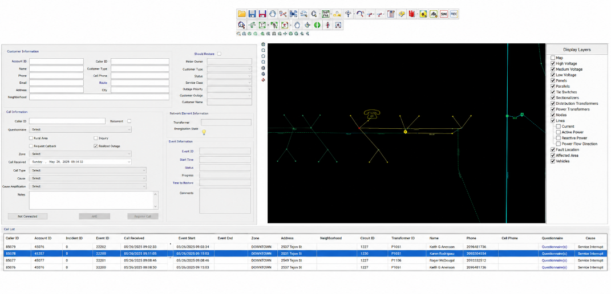

*Janela de gestão de eventos (Figura 15)*

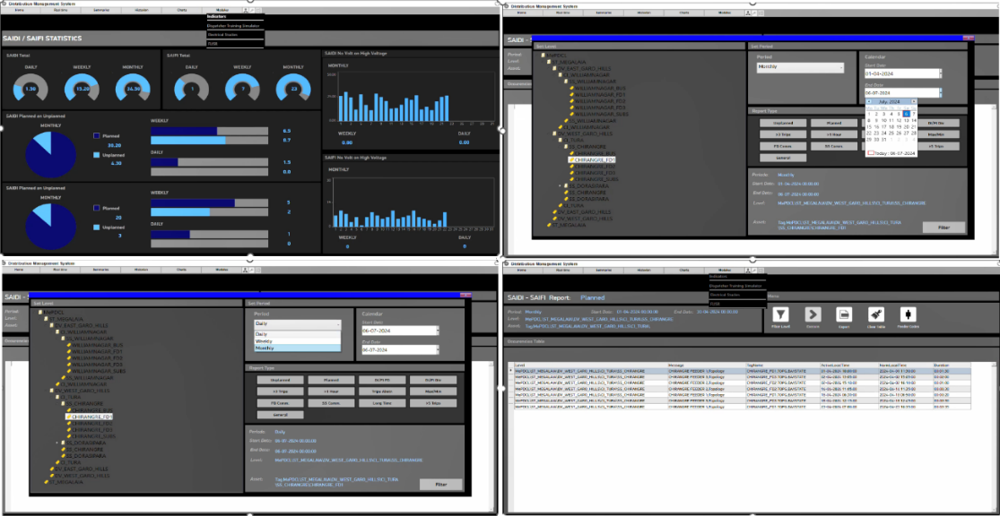

*Relatórios de indicadores SAIDI e SAIFI (Figura 16)*

---

<!-- ============================================================ -->
<!-- INVENTÁRIO DE ASSETS -->
<!-- ============================================================ -->

# Inventário de assets

| Arquivo | Origem no .docx | Onde usar |
|---|---|---|
| `logo-sharika-spintech-dark.png` | Logo Software OEM, composto sobre navy | Header e footer de todas as páginas |
| `logo-sharika-spintech.png` | Logo Software OEM original (fundo branco) | Reserva / favicon |
| `arquitetura-solucao-adms.png` | Figura 11 — **ISR removido** | Página 1 (1.2) |
| `arquitetura-centro-controle.png` | Figura 21 — Arquitetura geral / MCC | Página 1 (2.1) |
| `dts-telas-instrutor.png` | Figura 17 — Telas do instrutor DTS | Página 1 (1.2.4) |
| `scada-camadas.png` | Figura 41 — Camadas do SCADA | Página 2 (4.1) |
| `scada-ambiente-scripts.png` | Figura 42 — Ambiente de scripts | Página 2 (4.4) |
| `scada-tendencias.png` | Figura 43 — Tendências RT/histórico | Página 2 (4.5) |
| `scada-resumo-eventos.png` | Figura 44 — Resumo de eventos | Página 2 (4.6) |
| `adms-arquitetura-dms.png` | Figura 61 — Arquitetura do DMS | Página 3 (6.1) |
| `adms-rede-distribuicao-b.png` | Figura 12 — Display da rede | Página 3 (galeria) |
| `adms-rede-distribuicao-a.png` | Figura 12 — recorte auxiliar | Opcional |
| `adms-criterios-localizacao-falta.png` | Figura 13 — Localizador de faltas | Página 3 (galeria) |
| `adms-gestao-falta-restauracao.png` | Figura 14 — Gestão de faltas | Página 3 (galeria) |
| `oms-arquitetura-funcional.png` | Figura 71 — Arquitetura funcional OMS | Página 4 (7.1) |
| `oms-janela-gestao-eventos.png` | Figura 15 — Gestão de eventos | Página 4 (galeria) |
| `oms-relatorios-saidi-saifi.png` | Figura 16 — SAIDI/SAIFI | Página 4 (galeria) |

## Observações sobre as imagens

- `arquitetura-centro-controle.png` é o desenho técnico do MCC. No Word, três rótulos
  ficavam em caixas de texto **sobrepostas** ao desenho e não existem no PNG exportado:
  *993 FRTUs (todas as cidades)*, *39 FPIs* e *10 DTMUs*. Eles foram preservados como
  legenda em texto abaixo da figura — não desenhar sobre a imagem.
- Os diagramas de arquitetura ainda exibem o rótulo "GridQ" na barra de título, porque
  não devem ser redesenhados. Se o rebranding precisar chegar às imagens, isso deve ser
  tratado como uma edição pontual das figuras existentes.
